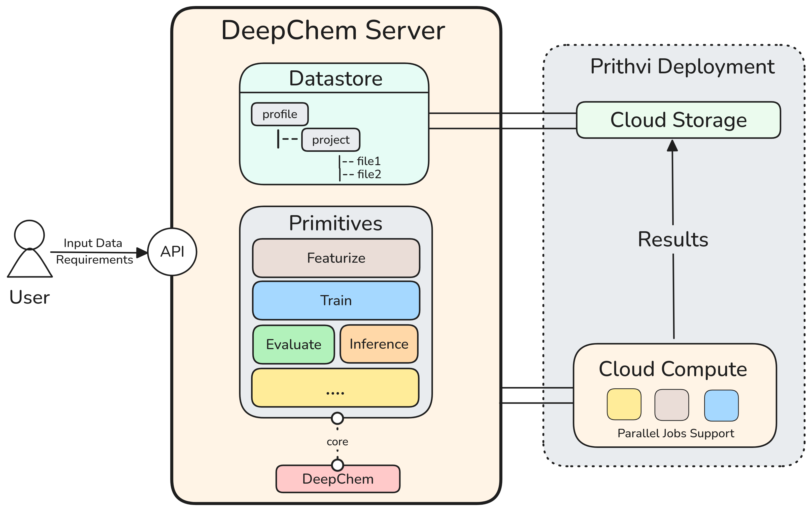

DeepChem Server Documentation
==============================

Overview
--------
Welcome to DeepChem Server, a minimal cloud infrastructure for DeepChem that provides a FastAPI-based backend for managing datasets, running featurization tasks, and building machine learning models with DeepChem.

DeepChem Server offers a streamlined way to:

* Upload and manage datasets in various formats
* Perform molecular featurization using DeepChem's extensive featurizer library
* Store and retrieve models and data through a unified datastore API
* Access functionality through both REST API endpoints and a Python client library

The server is designed for running scientific discovery pipelines at scale, supporting asynchronous execution for concurrent job processing and distributed computing infrastructure integration.

Architecture
-----------

**API Layer**
    FastAPI application with routers for data management (`/data`) and computational primitives (`/primitive`). Supports file uploads, dataset featurization, and model operations through HTTP endpoints. The API supports asynchronous execution, enabling multiple requests to run concurrently and efficiently.

**Core Modules**
    
    * **Featurization Engine**: Multi-core molecular featurization with checkpoint/restart capabilities
    * **Datastore**: Abstract storage interface with disk-based implementation
    * **Compute Workflow**: Program execution engine with primitive registry
    * **Card System**: Metadata management for datasets and models

**Storage System**
    Hierarchical datastore organized by profile and project namespaces. Objects are addressed using the `deepchem://` protocol format: `deepchem://profile_name/project_name/resource_name`. Input files and intermediate data are stored in a local DiskDatastore, organized by user profile and project to keep files structured and easy to manage.

**Primitive Operations**
    Atomic computational operations registered in the program map. Currently supports:
    
    * **featurize**: Transform molecular datasets using DeepChem featurizers
    * Additional primitives (train, predict) can be added by extending the registry

**Distributed Computing Support**
    The architecture is designed to integrate with distributed or cloud computing infrastructures for parallel job execution. Distributed/cloud backends can be added by extending the backend interface.

Core Concepts
-------------

**Datastore Objects**
    Two main object types with associated metadata cards:
    
    * **DataCard**: Metadata for datasets including file type, data type, shape, featurizer used
    * **ModelCard**: Metadata for trained models including model type, training dataset, parameters

**Multi-Core Processing**
    Large datasets are automatically partitioned and processed in parallel using multiprocessing. Checkpoint files enable job restart on failure.

**Address Resolution**
    Resources are located using hierarchical addressing: `deepchem://profile/project/resource`. The datastore resolves these addresses to local file system paths.

**Asynchronous Job Processing**
    The API supports asynchronous execution, allowing users to submit jobs, check status, and retrieve results through the same API interface. Multiple requests can run concurrently for efficient resource utilization.

Data Flow
---------

1. **Upload**: Files uploaded via `/data/uploaddata` endpoint
2. **Storage**: Files stored in datastore with metadata cards
3. **Processing**: Primitives executed via `/primitive/featurize` endpoint
4. **Computation**: ComputeWorkflow dispatches to registered primitive functions
5. **Output**: Results stored in datastore with new addresses returned

Supported Formats
----------------

**Input Formats**
    * CSV files with SMILES columns
    * SDF files with molecular structures
    * JSON, XML, and other text formats
    * Binary formats (DCD, ONNX, HDF5)

**Output Formats**
    * DeepChem DiskDataset objects
    * Numpy arrays for featurized data
    * Model files for trained models

**Metadata Storage**
    * `.cdc` files for DataCards
    * `.cmc` files for ModelCards

Configuration
-------------

**Environment Variables**
    * `DATADIR`: Base directory for datastore (default: `/data`)
    * `BACKEND`: Compute backend (currently only 'local' supported)

**Docker Deployment**
    Containerized deployment with volume mounting for persistent storage. Default port 8000 with automatic API documentation at `/docs`.

Client Integration
-----------------

**Python SDK (py-ds)**
    Lightweight Python SDK for easy integration in Python-based clients or automation scripts. Provides high-level functions for data upload, featurization, and workflow management.

**API Interface**
    Users interact with the same API to submit jobs, check status, and retrieve results. The API supports both synchronous and asynchronous execution modes.

.. toctree::
   :maxdepth: 2
   :caption: Contents:

   get_started/index
   api_reference/index
   py_ds_library/index

Quick Start
-----------

To get started with DeepChem Server:

1. **Installation**: Clone the repository and run the server using Docker
2. **Upload Data**: Use the API or Python client to upload your datasets
3. **Featurize**: Transform your molecular data using DeepChem featurizers
4. **Build Models**: Train and deploy machine learning models

Server Setup
~~~~~~~~~~~~

The fastest way to get started is using Docker:

.. code-block:: bash

   git clone <repository-url>
   cd deepchem-server
   bash docker.sh

This will start the server on ``http://localhost:8000``.

Key Features
------------

* **FastAPI Backend**: Modern, fast web framework with automatic API documentation
* **DeepChem Integration**: Built-in support for molecular featurization and modeling
* **Flexible Storage**: Disk-based datastore with support for various data formats
* **Python Client**: Easy-to-use Python library for programmatic access
* **Docker Support**: Containerized deployment for easy setup and scaling

Architecture Overview
---------------------

DeepChem Server consists of several key components:

* **API Layer**: FastAPI routers handling HTTP requests
* **Core Modules**: Business logic for data handling, featurization, and model management
* **Datastore**: Abstract storage layer with concrete disk implementation
* **Client Library**: Python SDK for easy integration

Indices and tables
==================

* :ref:`genindex`
* :ref:`modindex`
* :ref:`search` 