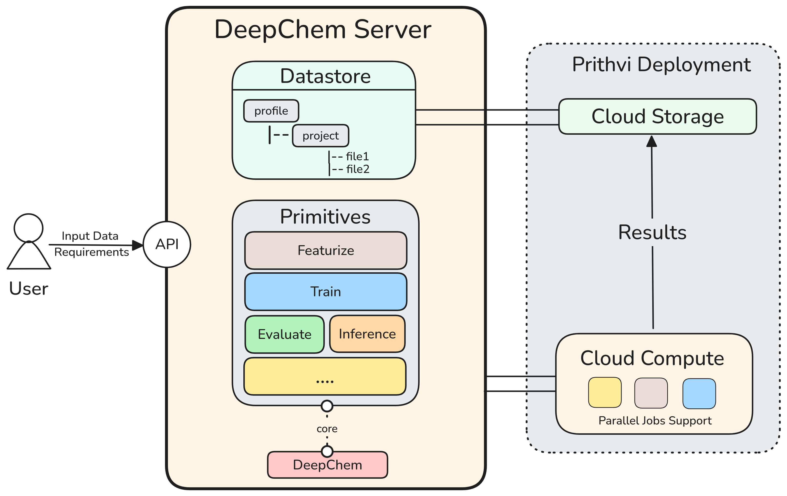

DeepChem Server Documentation
==============================

**What is DeepChem Server?**

DeepChem Server is a minimal cloud infrastructure for molecular machine learning that provides a FastAPI-based backend for 
managing datasets, running featurization tasks, and building machine learning models with DeepChem.

DeepChem Server simplifies molecular machine learning workflows by providing:

* **FastAPI Backend**: Modern, fast web framework with automatic API documentation
* **DeepChem Integration**: Built-in support for molecular featurization and modeling powered by DeepChem library
* **Flexible Storage**: Disk-based datastore with support for various data formats
* **Python Client**: Easy-to-use pyds library for programmatic access
* **Containerized Deployment**: First-class Docker support for easy setup and scaling

This documentation will guide you through setting up and using DeepChem Server for your molecular machine learning projects. 
Whether you're new to the platform or looking to integrate it into existing workflows, you'll find comprehensive guides covering 
installation, server configuration, available computation primitives, and the Python client library for programmatic access.

.. toctree::
   :maxdepth: 3
   :caption: Getting Started

   get_started/index

.. toctree::
   :maxdepth: 3
   :caption: Backend Server

   backend_server/index

.. toctree::
   :maxdepth: 3
   :caption: Core Primitives

   primitives

.. toctree::
   :maxdepth: 3
   :caption: PyDS Library

   py_ds_library/index
